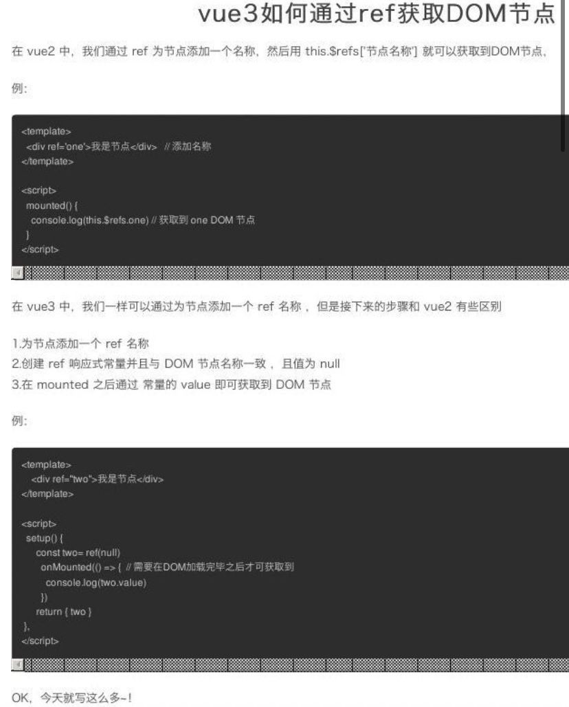
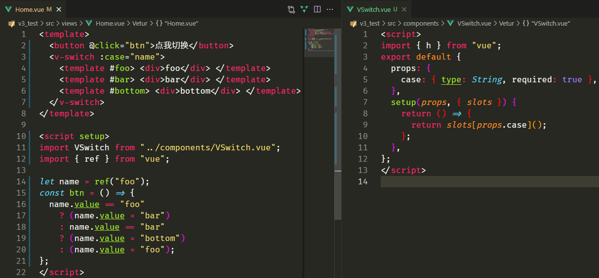
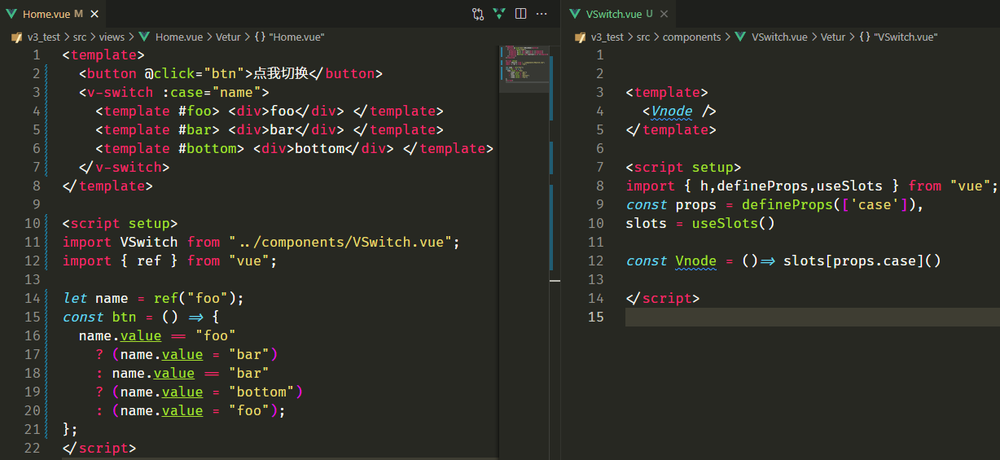

# 一、创建Vue3.0工程

## 1.使用 vue-cli 创建

官方文档：[https://cli.vuejs.org/zh/guide/creating-a-project.html#vue-create](https://cli.vuejs.org/zh/guide/creating-a-project.html#vue-create "https://cli.vuejs.org/zh/guide/creating-a-project.html#vue-create")

```bash
## 查看@vue/cli版本，确保@vue/cli版本在4.5.0以上
vue --version
## 安装或者升级你的@vue/cli
npm install -g @vue/cli
## 创建
vue create vue_test
## 启动
cd vue_test
npm run serve


在package.js中可以看到vue3的版本号
当前项目路径使用 npm i vue@next 来下载最新版vue

```

## 2.使用 vite 创建

官方文档：[https://v3.cn.vuejs.org/guide/installation.html#vite](https://v3.cn.vuejs.org/guide/installation.html#vite "https://v3.cn.vuejs.org/guide/installation.html#vite")

vite官网：[https://vitejs.cn](https://vitejs.cn "https://vitejs.cn")

*   什么是vite？—— 新一代前端构建工具。

*   优势如下：

    *   开发环境中，无需打包操作，可快速的冷启动。

    *   轻量快速的热重载（HMR）。

    *   真正的按需编译，不再等待整个应用编译完成。

*   传统构建 与 vite构建对比图

```bash
##新的脚手架create-vue
npm init vue@3
npm init vue@2

## 创建工程
npm init vite@latest (推荐 和官网最新的方法一样
npm init vite-app <project-name>
## 进入工程目录
cd <project-name>
## 安装依赖
npm install
## 运行
npm run dev
```

# 二、常用 Composition API

官方文档: [https://v3.cn.vuejs.org/guide/composition-api-introduction.html](https://v3.cn.vuejs.org/guide/composition-api-introduction.html "https://v3.cn.vuejs.org/guide/composition-api-introduction.html")

## 1.拉开序幕的setup

1.  理解：Vue3.0中一个新的配置项，值为一个函数。

2.  setup是所有Composition API（组合API）“ 表演的舞台 ”。

3.  组件中所用到的：数据、方法等等，均要配置在setup中。

4.  setup函数的两种返回值：

    1.  若返回一个对象，则对象中的属性、方法, 在模板中均可以直接使用。（重点关注！）

    2.  若返回一个渲染函数：则可以自定义渲染内容。（了解）

5.  注意点：

    1.  尽量不要与Vue2.x配置混用

        *   Vue2.x配置（data、methos、computed...）中可以访问到setup中的属性、方法。

        *   但在setup中不能访问到Vue2.x配置（data、methos、computed...）。

        *   如果有重名, setup优先。

    2.  setup不能是一个async函数，因为返回值不再是return的对象, 而是promise, 模板看不到return对象中的属性。（**后期也可以返回一个Promise实例，但需要Suspense和异步组件的配合**）

## 2.ref函数

*   作用: 定义一个响应式的数据

*   语法: `const xxx = ref(initValue)`

    *   创建一个包含响应式数据的引用对象（reference对象，简称ref对象）。

    *   JS中操作数据： `xxx.value`

    *   模板中读取数据: 不需要.value，直接：`<div>{{xxx}}</div>`

*   备注：

    *   接收的数据可以是：基本类型、也可以是对象类型。

    *   基本类型的数据：响应式依然是靠`Object.defineProperty()`的`get`与`set`完成的。

    *   对象类型的数据：内部 “ 求助 ” 了Vue3.0中的一个新函数—— `reactive`函数。

## 3.reactive函数

*   作用: 定义一个对象类型的响应式数据（基本类型不要用它，要用`ref`函数）

*   语法：`const 代理对象= reactive(源对象)`接收一个对象（或数组），返回一个代理对象（Proxy的实例对象，简称proxy对象）

*   reactive定义的响应式数据是“深层次的”。

*   内部基于 ES6 的 Proxy 实现，通过代理对象操作源对象内部数据进行操作。

## 4.Vue3.0中的响应式原理

### vue2.x的响应式

*   实现原理：

    *   对象类型：通过`Object.defineProperty()`对属性的读取、修改进行拦截（数据劫持）。

    *   数组类型：通过重写更新数组的一系列方法来实现拦截。（对数组的变更方法进行了包裹）。

        ```javascript
        Object.defineProperty(data, 'count', {
            get () {}, 
            set () {}
        })
        ```

*   存在问题：

    *   新增属性、删除属性, 界面不会更新。

    *   直接通过下标修改数组, 界面不会自动更新。

### Vue3.0的响应式

*   实现原理:

    *   通过Proxy（代理）:  拦截对象中任意属性的变化, 包括：属性值的读写、属性的添加、属性的删除等。

    *   通过Reflect（反射）:  对源对象的属性进行操作。

    *   MDN文档中描述的Proxy与Reflect：

        *   Proxy：[https://developer.mozilla.org/zh-CN/docs/Web/JavaScript/Reference/Global\_Objects/Proxy](https://developer.mozilla.org/zh-CN/docs/Web/JavaScript/Reference/Global_Objects/Proxy "https://developer.mozilla.org/zh-CN/docs/Web/JavaScript/Reference/Global_Objects/Proxy")

        *   Reflect：[https://developer.mozilla.org/zh-CN/docs/Web/JavaScript/Reference/Global\_Objects/Reflect](https://developer.mozilla.org/zh-CN/docs/Web/JavaScript/Reference/Global_Objects/Reflect "https://developer.mozilla.org/zh-CN/docs/Web/JavaScript/Reference/Global_Objects/Reflect")

            ```javascript
            new Proxy(data, {
              // 拦截读取属性值
                get (target, prop) {
                  return Reflect.get(target, prop)
                },
                // 拦截设置属性值或添加新属性
                set (target, prop, value) {
                  return Reflect.set(target, prop, value)
                },
                // 拦截删除属性
                deleteProperty (target, prop) {
                  return Reflect.deleteProperty(target, prop)
                }
            })

            proxy.name = 'tom'   
            ```

## 5.reactive对比ref

*   从定义数据角度对比：

    *   ref用来定义：基本类型数据。

    *   reactive用来定义：对象（或数组）类型数据。

    *   备注：ref也可以用来定义对象（或数组）类型数据, 它内部会自动通过`reactive`转为代理对象。

*   从原理角度对比：

    *   ref通过`Object.defineProperty()`的`get`与`set`来实现响应式（数据劫持）。

    *   reactive通过使用Proxy来实现响应式（数据劫持）, 并通过Reflect操作源对象内部的数据。

*   从使用角度对比：

    *   ref定义的数据：操作数据需要`.value`，读取数据时模板中直接读取不需要`.value`。

    *   reactive定义的数据：操作数据与读取数据：均不需要`.value`。

## 6.setup的两个注意点

*   setup执行的时机

    *   在beforeCreate之前执行一次，this是undefined。

*   setup的参数

    *   props：值为对象，包含：组件外部传递过来，且组件内部声明接收了的属性。

        *   props要声明接收，因为setup无法通过this获取值，所以只能通过参数props，不然内部无法获取外部的值

    *   context：上下文对象

        *   attrs: 值为对象，包含：组件外部传递过来，但没有在props配置中声明的属性, 相当于 `this.$attrs`。不声明接收props，则这里面就存着，声明就没存

        *   slots: 收到的插槽内容, 相当于 `this.$slots`。不写就是默认插槽，会显示default，并且起名用v-slot:xxx

        *   emit: 分发自定义事件的函数, 相当于 `this.$emit`。最好也声明接收用这个emits:\['xxx']

## 7.计算属性与监视

### 1.computed函数

*   与Vue2.x中computed配置功能一致

*   写法

    ```javascript
    import {computed} from 'vue'

    setup(){
        let person = reactive({
          firstName: "张",
          lastName: "三",
        });
        
      //计算属性——简写 没有考虑计算属性被修改的情况 这里返回的是用ref定义的需要.value
        let fullName = computed(()=>{
            return person.firstName + '-' + person.lastName
        })
        //计算属性——完整 
        let fullName = computed({
            get(){
                return person.firstName + '-' + person.lastName
            },
            set(value){
                const nameArr = value.split('-')
                person.firstName = nameArr[0]
                person.lastName = nameArr[1]
            }
        })
    }


    因为person是用响应式reactive定义的
    所以可以直接追加 不用let了
    person.fullName = computed(...);
    ```

### 2.watch函数

*   与Vue2.x中watch配置功能一致

*   两个小“坑”：

    *   监视reactive定义的响应式数据时：oldValue无法正确获取、强制开启了深度监视（deep配置失效）。

    *   监视reactive定义的响应式数据中**某个属性**时：deep配置有效。

    ```javascript
    //情况一：监视ref定义的响应式数据
    watch(sum,(newValue,oldValue)=>{
      console.log('sum变化了',newValue,oldValue)
    },{immediate:true})

    //情况二：监视多个ref定义的响应式数据
    watch([sum,msg],(newValue,oldValue)=>{
      console.log('sum或msg变化了',newValue,oldValue)
    }) 

    /* 情况三：监视reactive定义的响应式数据
        1.无法正确获得oldValue！！
        2.强制开启了深度监视 */
    watch(person,(newValue,oldValue)=>{
      console.log('person变化了',newValue,oldValue)
    },{immediate:true,deep:false}) //此处的deep配置不再奏效
    //这种会浪费性能


    //情况四：监视reactive定义的响应式数据中的某个属性
    //写成回调函数 返回值就是监视的值
    watch(()=>person.job,(newValue,oldValue)=>{
      console.log('person的job变化了',newValue,oldValue)
    },{immediate:true,deep:true}) 

    //情况五：监视reactive定义的响应式数据中的某些属性
    watch([()=>person.job,()=>person.name],(newValue,oldValue)=>{
      console.log('person的job变化了',newValue,oldValue)
    },{immediate:true,deep:true})

    //特殊情况：检测reactive定义的对象中的对象，里面值改变得加deep
    watch(()=>person.job,(newValue,oldValue)=>{
        console.log('person的job变化了',newValue,oldValue)
    },{deep:true}) //此处由于监视的是reactive所定义的对象中的某个属性(并且是对象)，所以deep配置有效
    ```

监视ref基本类型不需要.value监视ref定义的对象类型需要.value 或者deep:true因为生成的Reflmp.value是个对象 除非直接替换掉整个对象否则检测不到

### 3.watchEffect函数

*   watch的套路是：既要指明监视的属性，也要指明监视的回调。

*   watchEffect的套路是：不用指明监视哪个属性，监视的回调中**用到哪个属性，那就监视哪个属性。**

*   默认开启immediate，开局就执行一次

*   watchEffect有点像computed：

    *   但computed注重的计算出来的值（回调函数的返回值），所以必须要写返回值。

    *   而watchEffect更注重的是过程（回调函数的函数体），所以不用写返回值。

    ```javascript
    //watchEffect所指定的回调中用到的数据只要发生变化，则直接重新执行回调。
    watchEffect(()=>{
        const x1 = sum.value
        const x2 = person.age
        console.log('watchEffect配置的回调执行了')
    })
    ```

## 8.生命周期

Vue2
[https://cn.vuejs.org/images/lifecycle.png](https://cn.vuejs.org/images/lifecycle.png "https://cn.vuejs.org/images/lifecycle.png")
Vue3
[https://v3.cn.vuejs.org/images/lifecycle.svg](https://v3.cn.vuejs.org/images/lifecycle.svg "https://v3.cn.vuejs.org/images/lifecycle.svg")

1

*   通过配置项则setup在beforeCreated前面执行，通过组合api则见第三条

*   Vue3.0中可以继续使用Vue2.x中的生命周期钩子，但有有两个被更名：

    *   `beforeDestroy`改名为 `beforeUnmount`

    *   `destroyed`改名为 `unmounted`

*   Vue3.0也提供了 Composition API (组合api)形式的生命周期钩子，与Vue2.x中钩子对应关系如下：

    *   `beforeCreate`===>`setup()`

    *   `created`=======>`setup()`

    *   `beforeMount` ===>`onBeforeMount`

    *   `mounted`=======>`onMounted`

    *   `beforeUpdate`===>`onBeforeUpdate`

    *   `updated` =======>`onUpdated`

    *   `beforeUnmount` ==>`onBeforeUnmount`

    *   `unmounted` =====>`onUnmounted`

    ```vue
    Vue2 ~~~~~~~~~~~ vue3
    beforeCreate  -> setup()
    created       -> setup()
    beforeMount   -> onBeforeMount
    mounted       -> onMounted
    beforeUpdate  -> onBeforeUpdate
    updated       -> onUpdated
    beforeDestroy -> onBeforeUnmount
    destroyed     -> onUnmounted
    activated     -> onActivated
    deactivated   -> onDeactivated
    ```

*   组合api先引入在使用

```javascript
import { onBeforeMount,onMounted } from "vue";
export default {
  setup() {
  onBeforeMount(()=>{ //里面写一个箭头函数
  
  })
  },
};
```

如果组合和配置项都写，那么组合api的先执行。不过一般没人这么写

**\$forceUpdate()**

```javascript
import { getCurrentInstance } from "vue";
setup(){
    let {ctx} = getCurrentInstance()
    ctx.$forceUpdate()
}

```

## 9.自定义hook函数 取坐标

<https://blog.csdn.net/weixin_43845137/article/details/123562385?utm_medium=distribute.wap_relevant.none-task-blog-2~default~baidujs_title~default-0-123562385-blog-123088032.wap_blog_relevant_default&spm=1001.2101.3001.4242.1&utm_relevant_index=1>

创建一个文件夹hooks

里面的xxx.js  一般小驼峰

```javascript
export default {
  setup() {
    let point = reactive({
        X:0,
        Y:0,
    });
    function btn(e) {
      console.log(1);
      point.X = e.pageX;
      point.Y = e.pageY;
    }
    onMounted(()=>{
      // window.addEventListener('mousemove',(e)=>{ 这样写后面移除不了
      //   console.log('1');
      //   btn(e)
      // })
      window.addEventListener('mousemove',btn) //管用
    })
    onUnmounted(()=>{
      // window.removeEventListener('mousemove',？？？) 第二个参数没法写写不了 
      window.removeEventListener('mousemove',btn) //立马好使
    })
    return {
      point
    };
  },
};
```

*   什么是hook？—— 本质是一个函数，把setup函数中使用的Composition API进行了封装。

*   类似于vue2.x中的mixin。

*   自定义hook的优势: 复用代码, 让setup中的逻辑更清楚易懂。

```javascript
比如我想使用上面取坐标的数据 函数钩子
我直接把相关的剪切掉
创建新文件夹hooks
里面文件名命名规范useXxx.js 比如usePoint.js
里面写
import { reactive,onMounted, onUnmounted } from "vue"; //还要引入
export default function(){
  粘贴进来整个逻辑
  比如那个point数据 btn函数 两个钩子
  return point
}

使用的时候！！！！！！！！！！！！
import usePoint from 'hooks/usePoint.js'
上面写的是个函数 所以直接调用
setup(){
    let point = usePoint() //返回值是啥呢 不就是上面return的point么
    return{
      point   //直接用
    }
}
```

## 10.toRef

*   作用：创建一个 ref 对象，其value值指向另一个对象中的某个属性。

*   被toRef后setup内修改要带.value

```javascript
  setup() {
    let person = reactive({
      xxx:123
    })
    return {
      xxx:person.xxx  //当你这样的时候 你在改xxx的值是不会响应式而且也改不了的
                       //因为基本类型地址不一样
                       
      xxx:person     //这样可以的 因为应用类型地址一样
      person         //或者直接简写
    };
  },
```

*   语法：`const name = toRef(person,'name')`

```javascript
  setup() {
    let person = reactive({
      xxx:123,
      xxx2:{
        xxx3:234
      }
    })
    return {
      xxx:toRef(person,'xxx'),
      xxx3:toRef(person.xxx2,'xxx3')
    };
  },
```

*   应用:   要将响应式对象中的某个属性单独提供给外部使用时。

*   扩展：`toRefs` 与`toRef`功能一致，但可以批量创建多个 ref 对象，语法：`toRefs(person)`这样不传第二参数 直接把里面全部处理

```javascript
  setup() {
    let obj = reactive({
      sum:1,
      name:'xxx'
    })
    return {
      ...toRefs(obj), //这样直接全取出来
    };
  },
```

## 11.全局变量挂载

```typescript
// vue2

Vue.prototype.$lm = {}

// vue3

const app = Vue.createApp({})

app.config.globalProperties.$lm = {}
```

# 三、其它 Composition API

## 1. shallowRef 与shallowReactive&#x20;

*   shallowReactive：只处理对象最外层属性的响应式（浅响应式）。

*   浅层次的响应式，不会遍历所有层次做响应式

*   shallowRef：传入基本类型则和ref没区别，传入对象类型则不处理

*   什么时候使用?

    *   如果有一个对象数据，结构比较深, 但变化时只是外层属性变化 ===> shallowReactive。

    *   如果有一个对象数据，后续功能不会修改该对象中的属性，而是生新的对象来替换 ===> shallowRef。

## 2.readonly 与 shallowReadonly

传入响应式数据(基本好像也行) xxx = readonly(xxx)

*   readonly: 让一个响应式数据变为只读的（深只读）。

*   shallowReadonly：让一个响应式数据变为只读的（浅只读）。

*   应用场景: 不希望数据被修改时。

## 3.toRaw 与 markRaw

*   toRaw：

    *   作用：将一个由`reactive`生成的响应式对象转为普通对象。

    *   使用场景：用于读取响应式对象对应的普通对象，对这个普通对象的所有操作，不会引起页面更新。

*   markRaw：

    *   作用：标记一个对象，使其永远不会再成为响应式对象。

```javascript
  setup() {

    let obj = reactive({
      sum:1
    })

  let car = {name:xxx,age:xxx}
  
  obj.car = car  //这样新增的car就是响应式 因为obj是reactive生成的
  obj.car = markRow(car) //这样car永远不会响应式
  
    return {
      obj
    };
  },
```

*   应用场景:

    1.  有些值不应被设置为响应式的，例如复杂的第三方类库等。

    2.  当渲染具有不可变数据源的大列表时，跳过响应式转换可以提高性能。

## 4.customRef

```javascript
  <input type="text" v-model="keyword" />
  <h3>{{keyword}}</h3> 模板 
setup() {

    //自定义ref
    function myRef(val){
      return customRef(里面传一个函数并且要返回一个对象并且里面需要有get set)
    }
    //自定义写法
    function myRef(val){
      return customRef(()=>{
        return {
          get(){},
          set(){}
        }
      })
    }
      
    //自定义ref！！！比如
    function myRef(val){
      return customRef((track,trigger)=>{
        return {
          get(){
            track() //通知vue追踪val的变化
            return val
          },
          set(newVal){
            //这里能拿到newVal了 哪怎么改呢
            val = newVal //val是形参 形参也可以改
            //但是现在必须让get在调用一次把数据送出去
            trigger()//vue重新解析模板 重新解析就重新get 但是上面必须通知追踪
          }
        }
      })
    }
      
    let keyword = ref('hello') //使用vue提供的ref
    let keyword = myRef('hello') //使用自己提供的ref
    
    return {keyword};
  },
```

*   作用：创建一个自定义的 ref，并对其依赖项跟踪和更新触发进行显式控制。

*   实现防抖效果：

    ```vue
    <template>
      <input type="text" v-model="keyword">
      <h3>{{keyword}}</h3>
    </template>

    <script>
      import {ref,customRef} from 'vue'
      export default {
        name:'Demo',
        setup(){
          // let keyword = ref('hello') //使用Vue准备好的内置ref
          //自定义一个myRef
          function myRef(value,delay){
            let timer
            //通过customRef去实现自定义
            return customRef((track,trigger)=>{
              return{
                get(){
                  track() //告诉Vue这个value值是需要被“追踪”的
                  return value
                },
                set(newValue){
                  clearTimeout(timer)
                  timer = setTimeout(()=>{
                    value = newValue
                    trigger() //告诉Vue去更新界面
                  },delay)
                }
              }
            })
          }
          let keyword = myRef('hello',500) //使用程序员自定义的ref
          return {
            keyword
          }
        }
      }
    </script>
    ```

## 5.provide 与 inject (提供与注入)

*   作用：实现祖与后代组件间通信

*   套路：父组件有一个 `provide` 选项来提供数据，后代组件有一个 `inject` 选项来开始使用这些数据

*   具体写法：

    1.  祖组件中：

        ```javascript
        setup(){
          ......
            let car = reactive({name:'奔驰',price:'40万'})
            provide('car',car)
            ......
        }
        ```

    2.  后代组件中：

        ```javascript
        setup(props,context){
          ......
            const car = inject('car')
            return {car}
          ......
        }
        ```

```javascript
作为公共状态使用（另一种写法 写在setup外面

App.vue中
<script>
import {reactive} from "vue"

//创建全局状态 这段可以封装一下
const store = {
  message:reactive("123"),
  setMsg(value){
    this.message = value
  }
}

export default {
  name: "App",
  provide:{ //提供数据
    store
  }
};
</script>

在子组件中
<h2>{{store.state.message}}</h2>
<button @click="store.state。setMsg(xxx)"> //修改值

<script>
import { reactive, ref, toRefs } from "@vue/reactivity";
export default {
  setup() {},
  inject:["store"]   //导入到setup外面模板里居然可以直接用
};
</script>
```

## 6.响应式数据的判断

*   isRef: 检查一个值是否为一个 ref 对象

*   isReactive: 检查一个对象是否是由 `reactive` 创建的响应式代理

*   isReadonly: 检查一个对象是否是由 `readonly` 创建的只读代理

*   isProxy: 检查一个对象是否是由 `reactive` 或者 `readonly` 方法创建的代理

## 7.像v2一样ref获取dom



## 8.v3中的组件通性方式总结

<https://www.jb51.net/article/231936.htm>

```html
vue3组件通信方式为以下几种

props
$emit
$expose / ref
$attrs
v-model
provide / inject
Vuex
mitt


props
<child :msg2="msg2" />
<script setup>
    const props = defineProps({
        // 写法一
        msg2:String
        // 写法二
        msg2:{
            type:String,
            default:''
        }
    })
    console.log(props) // {msg2:'这是传级子组件的信息2'}
</script>


$emit
//Child.vue
<template>
    // 写法一
    <div @click="emit('myclick')">按钮</div>
    // 写法二
    <div @click="handleClick">按钮</div>
</template>
<script setup>
    // 方法一
    const emit = defineEmits(['myClick'],['myClick2'])
    // 方法二
    const handleClick = () => {
        emit('myClick','这是发送给父组件的信息');
     }
       
     // 方法二 不适用于vue3.2，使用的useContext()已经舍弃
     import { useContext } from 'vue'
     const { emit } = useContext()
     const handleClick = () => { 
      emit('myClick','这是发送给父组件的信息'  
     }
</script>
  
// Parent.vue响应
<template>
    <child @myClick="onMyClick"></child>
</template>
<script setup>
    import child from "./child.vue"
    import onMychilk = (msg) => {
        console.log(msg) // 父组件收到的信息 
    }
</script>


expose / ref
父组件获取子组件的属性或者调用子组件方法
<script setup>
    // 方法一：useContext() vue3.2 之后已经舍弃
    import { useContext } from 'vue'
    const ctx = useContext()
    // 对外暴露属性方法等都可以
    ctx.expose({
        childName: '这是子组建的属性',
        someMethod(){
        console.log('这是子组件的方法')
        }
    })
</script>
  
// Parent.vue 注意 ref="comp"
<template>
    <child ref="comp"></child>
    <button @click="handleClick">按钮</button>
</template>
<script>
    import child from './child.vue'
    import { ref } from 'vue'
    const comp = ref(null)
    const handleClick = () => {
        console.log(comp.value.childName)
        comp.value.someMethod() // 调用子组件对外暴露的方法
    }
</script>


attts
attrs:包含父作用域除class和style除外的非props属性集合

// 父组件
<child :msg1="msg1" :msg2="msg2" title="3333"></child>
<script setup>
    import child from './child.vue'
    import { ref,reactive } from 'vue
    const msg1 = ref('111')
    const msg2 = ref('222')
</script>
  
// 子组件
<script setup>
    import { defineProps,useContext,useAttars } from 'vue'
    const props = defineProps({
        msg1: String
    })
      
    // 方法1
    const ctx = useContext()
    console.log(ctx.attars) // {msg2:'222',title:'333'}
      
    // 方法2 
    const attrs = useAttars()
    console.log(attars)  // {msg2:'2222',title:'3333'}
</script>
```

```html
v-model
可以支持多个数据双向绑定
<child v-model:key="key" v-modle:value="value" />
<script>
    import child from './child.vue'
    import { ref,reactive } from 'vue'
    const key = ref('111')
    const value = ref('222')
</script>
  
//子组件
<template>
   <button @click="handleClick"></button>
</template>
<script setup>
    // 方法一  v3.2 已被移除
    import { useContext } from 'vue'
    const { emit } = useContext()
      
    // 方法二
    import { defineEmits } from 'vue'
    const emit = defineEmits(['key','value'])
      
    //用法
    const handleClick = () => {
        emit('update:key','新的key')
        emit('update:value','新的value')
    }
</script>


provide / inject
provide/inject为依赖注入 provide：可以让我们指定想要提供给后代组件的数据 inject:在任何后代组件中接受想要添加在这个组件上的数据，不管组件嵌套多深都可以直接拿来用

// 父组件
<script setup>
    import { provide } from 'vue'
    const name = provide('name')
    console.log('name','沐华')
</script>
//子组件
<script setup>
    import { inject } from 'vue'
    const name = inject('name')
    console.log(name) //木华
</script>


Vuex
//store/index.js
import { createStore } from 'vuex'
export default createStore({
    state:{count:1},
    getters:{
        getCount:state=>state.count
    },
    mutations:{
        add(state){
            state.count++
        }
    }
   })
 // main.js
 import { createApp } from 'vue'
 import APP from './App.vue'
 import store from './store'
 createApp(APP).use(store).mount("#app")
   
 // 直接使用
 <template>
     <div>
         {{ $store.state.count }}
     </div>
     <button @click="$store.commit('add')">
     </button>
 </template>
   
 // 获取
 <script setup>
     import { useStore,computed } from 'vuex'
     const store = useStore()
     console.log(store.state.count)
       
     const count = computed (()=>store.state.count)
     console.log(count)
 </script>
 
 
 
 
 
 
 
 
 
mitt
Vue3中已经没有了EventBus跨组件通信，替代方案mitt.js，但原理方式EventBus是一样的
安装方式 npm i mitt -S

mitt.js
import mitt from 'mitt'
const mitt = mitt()
export default mitt
组件之间使用

// 组件A 
<script setup>
    import mitt from './mitt'
    const handleClick = () => {
        mitt.emit('handleChange')
    }
</script>
// 组件B 
<script setup>
import mitt from './mitt'
import { onUnmounted } from 'vue'
const someMethod = () => {...}
mitt.on('handleChange',someMethod)
onUnmounted(()=>{
    mitt.off('handleChange',someMethod)
})
</script>
```

# 四、新的组件

## 1.Fragment

*   在Vue2中: 组件必须有一个根标签

*   在Vue3中: 组件可以没有根标签, 内部会将多个标签包含在一个Fragment虚拟元素中

*   好处: 减少标签层级, 减小内存占用

## 2.Teleport

*   什么是Teleport？—— `Teleport` 是一种能够将我们的组件html结构移动到指定位置的技术。

*   &#x20;要传送的结构  比如传送到body就可以通过body定位到想要的位置(也可以写css选择器 #main)

    ```vue
    <teleport to="移动位置">
      <div v-if="isShow" class="mask">
        <div class="dialog">
          <h3>我是一个弹窗</h3>
          <button @click="isShow = false">关闭弹窗</button>
        </div>
      </div>
    </teleport>
    ```

## 3.Suspense

*   等待异步组件时渲染一些额外内容，让应用有更好的用户体验

*   如果内部一个组件加载不出来那么所有的都展示不出来

*   使用步骤：
    //异步引入
    const Child = defineAsyncComponent(()=>import('./components/Child.vue'))

    *   异步引入组件

        ```javascript
        import Child from './components/Child.vue'  //静态引入

        import {defineAsyncComponent} from 'vue'
        ```

    *   使用`Suspense`包裹组件，并配置好`default` 与 `fallback`

        ```vue
        <template>
          <div class="app">
            <h3>我是App组件</h3>
            <Suspense>
              <template v-slot:default> //本该展示的组件
                <Child/>
              </template>
              <template v-slot:fallback> //loading组件
                <h3>加载中.....</h3>
              </template>
            </Suspense>
          </div>
        </template>
        ```

# 五、其他

## 1.全局API的转移

*   Vue 2.x 有许多全局 API 和配置。

    *   例如：注册全局组件、注册全局指令等。

        ```javascript
        //注册全局组件
        Vue.component('MyButton', {
          data: () => ({
            count: 0
          }),
          template: '<button @click="count++">Clicked {{ count }} times.</button>'
        })

        //注册全局指令
        Vue.directive('focus', {
          inserted: el => el.focus()
        }
        ```

*   Vue3.0中对这些API做出了调整：

    *   将全局的API，即：`Vue.xxx`调整到应用实例（`app`）上

        | 2.x 全局 API（`Vue`）        | 3.x 实例 API (`app`)          |
        | ------------------------ | --------------------------- |
        | Vue.config.xxxx          | app.config.xxxx             |
        | Vue.config.productionTip | 移除                          |
        | Vue.component            | app.component               |
        | Vue.directive            | app.directive               |
        | Vue.mixin                | app.mixin                   |
        | Vue.use                  | app.use                     |
        | Vue.prototype            | app.config.globalProperties |

<https://zhuanlan.zhihu.com/p/527827646?utm_source=wechat_session&utm_medium=social&utm_oi=917116009725427712>

## 2.其他改变

*   data选项应始终被声明为一个函数。

*   过度类名的更改：

    *   Vue2.x写法

        ```css
        .v-enter,
        .v-leave-to {
          opacity: 0;
        }
        .v-leave,
        .v-enter-to {
          opacity: 1;
        }
        ```

    *   Vue3.x写法

        ```css
        .v-enter-from,
        .v-leave-to {
          opacity: 0;
        }

        .v-leave-from,
        .v-enter-to {
          opacity: 1;
        }
        ```

*   移除keyCode作为 v-on 的修饰符，同时也不再支持`config.keyCodes`

*   移除`v-on.native`修饰符

    *   父组件中绑定事件

        ```vue
        <my-component
          v-on:close="handleComponentEvent"
          v-on:click="handleNativeClickEvent"
        />
        ```

    *   子组件中声明自定义事件

        ```vue
        <script>
          export default {
            emits: ['close']
          }
        </script>
        ```

*   移除过滤器（filter）

    > 过滤器虽然这看起来很方便，但它需要一个自定义语法，打破大括号内表达式是 “只是 JavaScript” 的假设，这不仅有学习成本，而且有实现成本！建议用方法调用或计算属性去替换过滤器。

*   ......

## 3 script setup

<https://github.com/vuejs/rfcs/blob/master/active-rfcs/>

使用生命周期

```vue
import { onMounted } from 'vue'
onMounted(() => {
    console.log('mounted!')
})


Vue2 ~~~~~~~~~~~ vue3
beforeCreate  -> setup()
created       -> setup()
beforeMount   -> onBeforeMount
mounted       -> onMounted
beforeUpdate  -> onBeforeUpdate
updated       -> onUpdated
beforeDestroy -> onBeforeUnmount
destroyed     -> onUnmounted
activated     -> onActivated
deactivated   -> onDeactivated

```

使用props和 emit

```vue
  不需要导出 直接用就行（这两个常用所以就不需要导出
import {defineEmits, defineProps, toRefs} from "vue"

const props = defineProps(["title","route"])
const props = defineProps({
    route:{
        type:String,
        default(){
            return  ""
        }
    },
    title:{
        type:String,
        default(){
            return  ""
        }
    }
})
const {route, title} = toRefs(props) //这段说实话每台看懂 props逻辑上不能被修改所以没必要响应式

在模板中可以直接使用title 也可以props.title


ts中设置props的默认值
import { withDefaults } from "vue";
const props = withDefaults(defineProps<{ title?: string }>(),{ title:'默认值' })

例
interface props {
  msg?: string;
}
const props = withDefaults(defineProps<props>(),{
  msg:"default hello"
});

```

获取context中的attr和slot 和emit

```typescript

<script setup>
import { useAttr , useSlots ,defineEmits } from "vue";

const slots = useSlots()

const attr = useAttr()

const emit = defineEmits(['change', 'delete'])
emit("change")

</script>
```

对外暴露属性 script setup默认不对外暴露 必须用defineExpose

```typescript

<script setup>

//无需引入直接使用
defineExpose({
  xxx,
  xxx
})


</script>
```

可以直接写await 会自动async 但是好像要配合Suspense&#x20;

```vue
<script setup>
import axios from "axios"
const {data} = await axios.get("http://plmm.site:4000/COVID_19")
console.log(data);
</script>
```

最好还是这样写

```vue
import axios from "@/axios";
const menusList = reactive({});
const getMenusList = async ()=>{
  menusList = await axios.get("/menus");
}
getMenusList()
```

动态子组件

```vue
<component :is="xxx ? Info : Foo "></component>

```

自定义指令

```vue
自定义指令名必须加个v 因为增强可读性

//创建一个vFocus.js
export default {
  mounted(el) {
    el.focus();
  },
};


//组件中试用
<template>
    <input type="text" v-focus>
</template>

<script setup>
import vFocus from '../../vFocus';
</script>


```

# 六、另外的细节

## v3和v2中的vuex

v3

```javascript
安装
npm install vuex@next --save

基本使用
import { createApp } from 'vue'
import { createStore } from 'vuex' //和v2相比就是引入改变别的基本没变

// 创建一个新的 store 实例
const store = createStore(...省略)

const app = createApp({ /* 根组件 */ })

// 将 store 实例作为插件安装
app.use(store)


作为模块
import { createStore } from 'vuex'
const store = createStore(...省略)
export default store

```

**v2**

```javascript
安装
npm install vuex --save

                      
import Vue from 'vue'                
import Vuex from 'vuex'
Vue.use(Vuex)
let store = new Vuex.Store(省略)
export default store
```

**vue2.0和vue3.0只是引用vuex的方式和安装方式改变了，使用是一样的没有改变(即忽略部分是一样的)**

## setup中使用async await

```vue

<script setup>
import { reactive } from "vue";
import axios from "@/axios";

const menusList = reactive({});
const getMenusList = async ()=>{
  menusList = await axios.get("/menus");
}
getMenusList()
console.log("获取列表", menusList);

</script> 
```

## 修改element plus的样式

```javascript
使用 ::v-deep

// 修改级联选择框的默认宽度
/deep/ .el-cascader {
  width: 100%;
}

[@vue/compiler-sfc] the >>> and /deep/ combinators have been deprecated. 
Use :deep() instead.
现在用这个了

```

## vue3中js定义css值

```vue
<template>
<div class="box"></div>
</template>

<script setup>
const boxWidth = "100px"   //定义**
</script>

<style lang="scss">
.box{
  background-color: red;
  width: v-bind(boxWidth);   //使用**
  height: 100px;
}
</style>
```

## vue中配置跨域代理

```vue
vue.config.js

module.exports = {
  devServer: {
    https:false,
    hotOnly:false, //是否热更新
    proxy: {
        '/api': {     //这里最好有一个 /
            target: 'http://lianghj.top:8888/api/private/v1/',  // 后台接口域名
            ws: false,        //如果要代理 websockets，配置这个参数
            secure: false,  // 如果是https接口，需要配置这个参数
            changeOrigin: true,  //是否跨域
            pathRewrite:{
                '^/api':''
            }
        }
    }
  }
};
```

## 全局字体

assets下放入一个字体文件

assets下创建css文件或者less sass

```typescript
@font-face{
  font-family:"SourceHanSans-Light";
  src:url("./SourceHanSans-Light.otf")
}

```

main.js中引入

```typescript
import"@/assets/css/fonts.css"

```

然后App.vue中使用就好

## 注册全局组件自己写组件

<https://www.bilibili.com/video/BV1dK411M7uu?spm_id_from=333.999.0.0>

全局注册组件

<https://v3.cn.vuejs.org/guide/component-registration.html>

```vue
import VSwitch from "./components/VSwitch.vue"

const app = createApp(App)

app.component("v-switch",VSwitch);
```

自己写一个类似switch组件



还有一种写法使用方法 这个slot居然自带h 不需要h了 我说怎么写了半天不行



```vue
home页中使用VSwitch组件


home页
<template>
  <button @click="btn">点我切换</button>
  <v-switch :case="name">
    <template #foo> <div>foo</div> </template>
    <template #bar> <div>bar</div> </template>
    <template #bottom> <div>bottom</div> </template>
  </v-switch>
</template>

<script setup>
import VSwitch from "../components/VSwitch.vue";
import { ref } from "vue";

let name = ref("foo"); //传入给组件页


// const btn = () => {
//   name.value == "foo"
//     ? (name.value = "bar")
//     : name.value == "bar"
//     ? (name.value = "bottom")
//     : (name.value = "foo");
// };
</script>


VSwitch组件页
<script>
import { h } from "vue";
export default {
  props: { case: { type: String, required: true } },
  setup(props, { slots }) {
    return () => {
      //这里相当于render函数创建了一个vnode slots里面存的其实就是vnode
      return slots[props.case]();
    };
  },
};
</script>

```

## .env

`.env` 无论开发环境还是生产环境都会加载的配置文件 &#x20;

`.env.development` 开发环境加载的配置文件 &#x20;

`.env.production` 生产环境加载的配置文件

环境变量的简单使用示例。需要注意，配置文件里的属性名必须以`VUE_APP_`开头，比如在`.env`文件这样声明一个环境变量：

```javascript
VUE_APP_buildSetting = `aaa`

```

然后在代码里面就可以用了

```javascript
console.log(process.env.VUE_APP_buildSetting)
```

那么首先，`Vue`在启动时，无论是在开发环境还是在生产环境，它始终都会加载`.env`文件里的内容，然后（划重点）=>`根据Node环境变量'NODE_ENV'的值来选择加载'development'还是'production'`。

比如我们平常通过`npm run serve`启动时，我们本地系统的环境变量`NODE_ENV` 值默认是`development`，这时就会先后加载`.env`和`.env.development`这两个文件。

而当我们打包到服务器后，服务器的`NODE_ENV`值一般为`production`，则此时Vue仍会先加载`.env`文件，然后加载`.env.production`文件。

其次，在按顺序加载文件时，`Vue`会把后一个加载的文件内容和前面加载的文件内容进行比较，如果存在变量名相同，那么它会`采用后一个文件里的变量值为变量的最终值`。

拿上面三个文件内容打个比方：我们在日常开发时，`NODE_ENV`值是`development`，那么`Vue`就会首先加载`.env`文件里的内容，然后继续加载`.env.development`文件里的内容。那么我们发现变量名`VUE_APP_QQQ`存在多个，这时`Vue`就会采用后一个文件里的变量值为变量的最终值。因此我们通过`console`输出看一看。

***

在vue项目根目录创建

.env.development

.env.production

```vue
里面写入路径
ENV = 'development'

VUE_APP_BASE_API = '/api'

------------------
ENV = 'production'

VUE_APP_BASE_API = '/prod-api'


在写请求的就时就可以取出来
axios.config.baseURL = process.env.VUE_APP_BASE_API
```

## proxy代理

```javascript
module.exports = {
  //跨域
  devServer: {
    port: 8080,
    proxy: {
      "/api": {
        target: "http://localhost:9877",
        // ws: true, //websocket
        changeOrigin: true, //是否跨域
        pathRewrite: {
          "^/api": "api",
        },
      },
    },
  },
};

```
